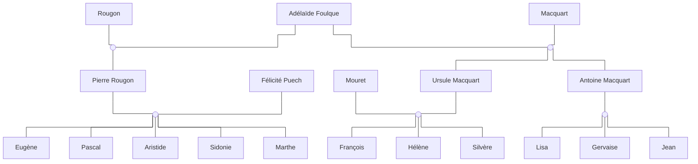
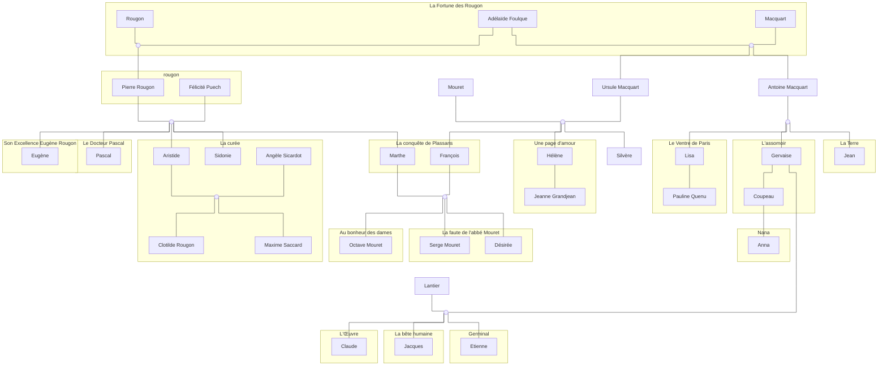

# Arbre généalogique Rougon-Macquart

Exemple d'utilisation de mermaid pour création d'un arbre généalogique.

## 3 générations

```mermaid
---
config:
  flowchart:
    curve: stepBefore
---
flowchart TD;
    R[Rougon] --- U1@{ shape: sm-circ, label: "Small start" }
    AF["Adélaïde Foulque"] --- U1
    AF --- U2@{ shape: sm-circ, label: "Small start" }
    M[Macquart] --- U2
    U1 --- PR[Pierre Rougon]
    U2 --- UM[Ursule Macquart]
    U2 --- AM[Antoine Macquart]
    PR --- U3@{ shape: sm-circ, label: "Small start" }
    FP[Félicité Puech] --- U3
    U3 --- ER[Eugène]
    U3 --- PaR[Pascal]
    U3 --- AR[Aristide]
    U3 --- SR[Sidonie]
    U3 --- MR[Marthe]
    AM --- U4@{ shape: sm-circ, label: "Small start" }
    U4 --- Lisa
    U4 --- Gervaise
    U4 --- JeM[Jean]
    Mouret --- U5@{ shape: sm-circ, label: "Small start" }
    UM --- U5
    U5 --- FMo[François]
    U5 --- HeMo[Hélène]
    U5 --- SMo[Silvère]
```

## 4 générations

Avec la mention des romans où ils apparaissent

```mermaid
---
config:
  flowchart:
    curve: stepBefore
---
flowchart TD;
    %% Génération 1
    subgraph La Fortune des Rougon
    R[Rougon] --- U11@{ shape: sm-circ, label: "Small start" }
    AF["Adélaïde Foulque"] --- U11
    AF --- U12@{ shape: sm-circ, label: "Small start" }
    M[Macquart] --- U12
    end
    %% Génération 2
    U11 --- PR[Pierre Rougon]
    U12 --- UM[Ursule Macquart]
    U12 --- AM[Antoine Macquart]
    PR --- U21@{ shape: sm-circ, label: "Small start" }
    FP[Félicité Puech] --- U21
    %% Génération 3
    U21 --- ER[Eugène]
    U21 --- PaR[Pascal]
    U21 --- AR[Aristide]
    U21 --- SR[Sidonie]
    U21 --- MR[Marthe]
    AM --- U22@{ shape: sm-circ, label: "Small start" }
    U22 --- Lisa
    U22 --- G[Gervaise]
    U22 --- JeM[Jean]
    Mouret --- U23@{ shape: sm-circ}
    UM --- U23
    U23 --- FrMo[François]
    U23 --- HeMo[Hélène]
    U23 --- SMo[Silvère]
    %% Génération 4
    G --- Coupeau --- Anna
    G ------ U32@{ shape: sm-circ}
    Lantier --- U32
    U32 --- Claude
    U32 --- Jacques
    U32 --- Etienne
    AR --- U33@{ shape: sm-circ}
    ASi[Angèle Sicardot] --- U33
    U33 --- ClRo[Clotilde Rougon]
    U33 --- MaSa[Maxime Saccard]
    MR --- U34@{ shape: sm-circ}
    FrMo --- U34
    U34 --- OcMo[Octave Mouret]
    U34 --- SeMo[Serge Mouret]
    U34 --- DeMo[Désirée]
    Lisa --- PaQu[Pauline Quenu]
    HeMo --- JeGr[Jeanne Grandjean]
    subgraph La conquête de Plassans
    MR
    FrMo
    end
    subgraph rougon
    U11
    PR
    FP
    end
    subgraph Son Excellence Eugène Rougon
    ER
    end
    subgraph La Terre
    JeM
    end
    subgraph La curée
    AR
    SR
    ASi
    U33
    ClRo
    MaSa
    end
    subgraph Le Docteur Pascal
    PaR
    end
    subgraph Une page d'amour
    HeMo
    JeGr
    end
    subgraph L'assomoir
    G
    Coupeau
    end
    subgraph Nana
    Anna
    end
    subgraph Le Ventre de Paris
    Lisa
    PaQu
    end
    subgraph L'Œuvre
    Claude
    end
    subgraph Germinal
    Etienne
    end
    subgraph La bête humaine
    Jacques
    end
    subgraph Au bonheur des dames
    OcMo
    end
    subgraph La faute de l'abbé Mouret
    SeMo
    DeMo
    end
    
```
