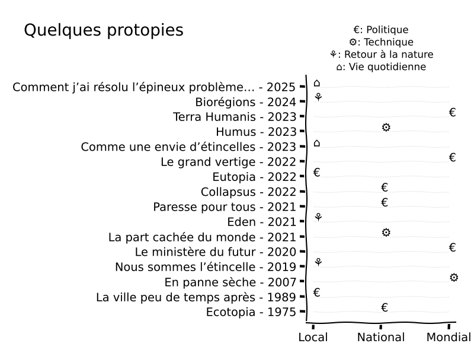

## Des fictions pour les transitions

Une présentation de quelques titres de [fictions pour les transitions](https://linumer.wordpress.com/des-fictions-pour-les-transitions/),
par ordre de parution et avec échelle géographique et aspects abordés.

Voir le code (initalement avec plotly, finalement avec matplotlib xkcd)